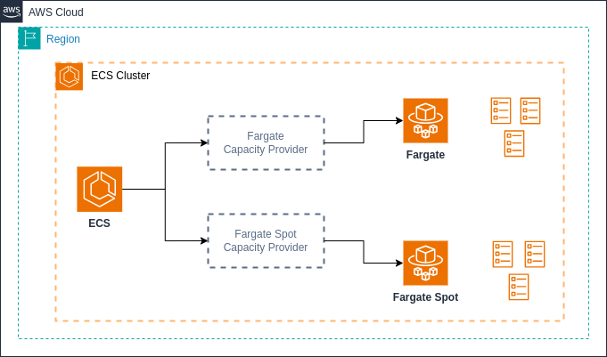

# **Módulo Terraform: cloudops-ref-repo-aws-ecs-cluster-terraform**

## Descripción:

Este módulo facilita la creación de un Cluster ECS en AWS con todas las mejores prácticas de seguridad, nomenclatura y configuración según los estándares.

Consulta CHANGELOG.md para la lista de cambios de cada versión. *Recomendamos encarecidamente que en tu código fijes la versión exacta que estás utilizando para que tu infraestructura permanezca estable y actualices las versiones de manera sistemática para evitar sorpresas.*

## Arquitectura



## Características

- Creación de clusters ECS con nomenclatura estandarizada
- Configuración de Container Insights
- Soporte para capacity providers (FARGATE y FARGATE_SPOT)
- Etiquetado estandarizado con soporte para etiquetas adicionales
- Validaciones para garantizar configuraciones correctas

## Estructura del Módulo
El módulo cuenta con la siguiente estructura:

```bash
cloudops-ref-repo-aws-ecs-cluster-terraform/
└── sample/ecs_cluster
    ├── data.tf
    ├── main.tf
    ├── outputs.tf
    ├── providers.tf
    ├── terraform.tfvars.sample
    └── variables.tf
├── .gitignore
├── CHANGELOG.md
├── data.tf
├── diagram.mermaid
├── main.tf
├── outputs.tf
├── providers.tf
├── README.md
├── variables.tf
```

- Los archivos principales del módulo (`data.tf`, `main.tf`, `outputs.tf`, `variables.tf`, `providers.tf`) se encuentran en el directorio raíz.
- `CHANGELOG.md` y `README.md` también están en el directorio raíz para fácil acceso.
- La carpeta `sample/` contiene un ejemplo de implementación del módulo.
- `diagram.mermaid` contiene el diagrama de arquitectura del módulo.

## Provider Configuration

Este módulo requiere la configuración de un provider específico para el proyecto. Debe configurarse de la siguiente manera:

```hcl
sample/ecs_cluster/providers.tf
provider "aws" {
  alias = "alias01"
  # ... otras configuraciones del provider
  
  default_tags {
    tags = var.common_tags
  }
}

sample/ecs_cluster/main.tf
module "ecs_cluster" {
  source = ""
  providers = {
    aws.project = aws.alias01
  }
  # ... resto de la configuración
}
```

## Uso del Módulo:

```hcl
module "ecs_cluster" {
  source = ""
  
  providers = {
    aws.project = aws.project
  }

  # Common configuration
  client      = "cliente01"
  project     = "proyecto01"
  environment = "dev"

  # ECS Cluster configuration 
  cluster_config = {
    "app01" = {
      containerInsights       = "enabled"
      enableCapacityProviders = true
      additional_tags         = {
        service-tier = "standard"
        backup-policy = "daily"
      }
    },
    "app02" = {
      containerInsights       = "enabled"
      enableCapacityProviders = false
      additional_tags         = {
        service-tier = "premium"
        backup-policy = "hourly"
      }
    }
  }
}
```

## Convenciones de nomenclatura

El módulo sigue un estándar de nomenclatura para los recursos:

```
{client}-{project}-{environment}-cluster-{app_name}
```

Por ejemplo:
- `cliente01-proyecto01-dev-cluster-app01`
- `pragma-payments-prod-cluster-orders`

## Etiquetado

El módulo maneja el etiquetado de la siguiente manera:

1. **Etiquetas obligatorias**: Se aplican a través del provider AWS usando `default_tags` en la configuración del provider.
   ```hcl
   provider "aws" {
     default_tags {
       tags = {
         environment = "dev"
         project     = "proyecto01"
         owner       = "cloudops"
         client      = "cliente01"
         area        = "infrastructure"
         provisioned = "terraform"
         datatype    = "operational"
       }
     }
   }
   ```

2. **Etiqueta Name**: Se genera automáticamente siguiendo el estándar de nomenclatura para cada recurso.

3. **Etiquetas adicionales por recurso**: Se pueden especificar etiquetas adicionales para cada cluster ECS individualmente mediante el atributo `additional_tags` en la configuración de cada cluster.

## Monitoreo

> **Nota importante**: Este módulo incluye la opción de habilitar Container Insights para monitoreo básico del cluster. Para implementar monitoreo y alertas más avanzadas, se recomienda utilizar el módulo específico de CloudWatch de Pragma CloudOps, que permite configurar alarmas para métricas de ECS como:
>
> - CPUUtilization
> - MemoryUtilization
> - RunningTaskCount
> - PendingTaskCount
> - ServiceCount
>
> Para una estrategia de monitoreo completa, considere implementar dashboards personalizados y alarmas específicas para sus servicios y tareas.

## Requirements

| Name | Version |
|------|---------|
| <a name="requirement_terraform"></a> [terraform](#requirement\_terraform) | >= 1.0 |
| <a name="requirement_aws"></a> [aws](#requirement\_aws) | >= 4.31.0 |

## Providers

| Name | Version |
|------|---------|
| <a name="provider_aws.project"></a> [aws.project](#provider\_aws) | >= 4.31.0 |

## Resources

| Name | Type |
|------|------|
| [aws_ecs_cluster.cluster](https://registry.terraform.io/providers/hashicorp/aws/latest/docs/resources/ecs_cluster) | resource |
| [aws_ecs_cluster_capacity_providers.cluster_capacity_providers](https://registry.terraform.io/providers/hashicorp/aws/latest/docs/resources/ecs_cluster_capacity_providers) | resource |

## Variables

| Name | Description | Type | Default | Required |
|------|-------------|------|---------|:--------:|
| <a name="environment"></a> [environment](#input\environment) | Environment where resources will be deployed (e.g., dev, qa, prod) | `string` | n/a | yes |
| <a name="client"></a> [client](#input\client) | Client name for resource naming and tagging | `string` | n/a | yes |
| <a name="project"></a> [project](#input\project) | Project name for resource naming and tagging | `string` | n/a | yes |
| <a name="cluster_config"></a> [cluster_config](#input\cluster_config) | Mapa de configuraciones de clusters ECS donde la clave es el nombre de la aplicación.| `map(object)` | n/a | yes |
| <a name="containerInsights"></a> [containerInsights](#input\containerInsights) | Value to assign to the setting. Valid values: enabled, disabled.| `string` | n/a | yes |
| <a name="enableCapacityProviders"></a> [enableCapacityProviders](#input\enableCapacityProviders) | If true, is enabled FARGATE and FARGATE_SPOT.| `bool` | n/a | yes |
| <a name="additional_tags"></a> [additional_tags](#input\additional_tags) | Additional tags to apply to the ECS cluster.| `map(string)` | `{}` | no |

## Outputs

| Name | Description |
|------|-------------|
| <a name="cluster_info.cluster_name"></a> [cluster_info.cluster_name](#output\cluster_info.cluster_name) | Cluster name |
| <a name="cluster_info.cluster_arn"></a> [cluster_info.cluster_arn](#output\cluster_info.cluster_arn) | Cluster ARN |
| <a name="cluster_info.cluster_id"></a> [cluster_info.cluster_id](#output\cluster_info.cluster_id) | Cluster ID |
| <a name="cluster_info.application"></a> [cluster_info.application](#output\cluster_info.application) | Application name |

## Mejores Prácticas Implementadas

- **Seguridad**: Validaciones para garantizar configuraciones correctas
- **Nomenclatura**: Estándar {client}-{project}-{environment}-cluster-{app_name}
- **Etiquetado**: Etiquetas completas según política (environment, project, owner, client) a través de `default_tags`
- **Modularización**: Estructura modular y reutilizable

## Configuración del Backend

> **Recomendación importante**: Para entornos de producción y colaboración en equipo, se recomienda configurar un backend remoto para almacenar el estado de Terraform (tfstate). Esto proporciona:
>
> - Bloqueo de estado para prevenir operaciones concurrentes
> - Respaldo y versionado del estado
> - Almacenamiento seguro de información sensible
> - Colaboración en equipo
>
> Ejemplo de configuración con S3 y DynamoDB:
>
> ```hcl
> terraform {
>   backend "s3" {
>     bucket         = "pragma-terraform-states"
>     key            = "ecs/terraform.tfstate"
>     region         = "us-east-1"
>     encrypt        = true
>     dynamodb_table = "terraform-locks"
>   }
> }
> ```
>
> Asegúrese de que el bucket S3 tenga el versionado habilitado y que la tabla DynamoDB tenga una clave primaria llamada `LockID`.

## Lista de verificación de cumplimiento

- [x] Nomenclatura de recursos conforme al estándar
- [x] Etiquetas obligatorias aplicadas a todos los recursos
- [x] Validaciones para garantizar configuraciones correctas
- [ ] Monitoreo y alertas (debe implementarse con el módulo CloudWatch)
- [x] Documentación actualizada
- [x] Revisión de seguridad completada

Este módulo ha sido desarrollado siguiendo los estándares, garantizando una implementación segura, escalable y optimizada que cumple con todas las políticas de la organización. Pragma CloudOps recomienda revisar este código con su equipo de infraestructura antes de implementarlo en producción.
